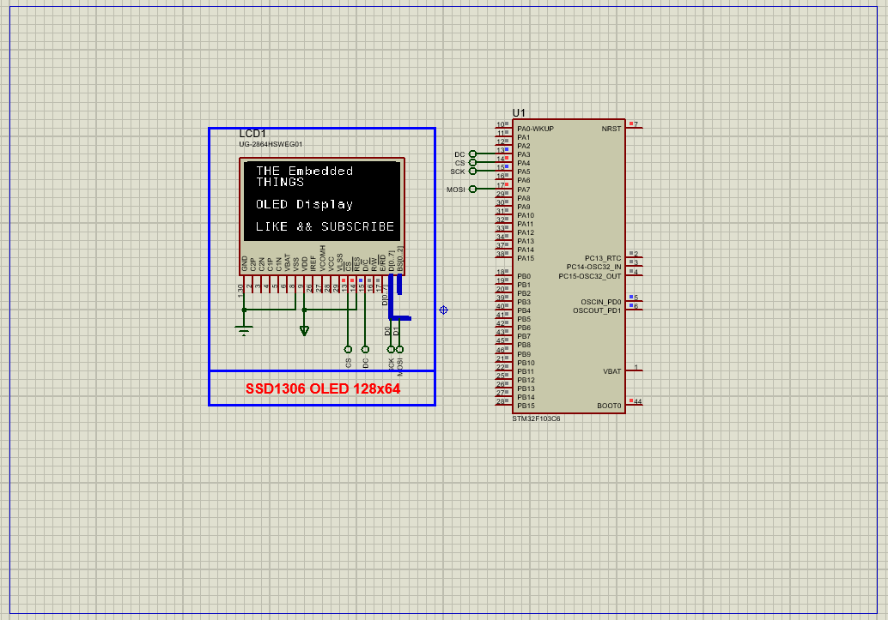

# Interfacing SSD1306 OLED with STM32 using SPI

This project demonstrates how to interface a **128x64 SSD1306 OLED display** with an STM32 microcontroller using SPI communication. The guide covers hardware setup, SPI configuration, and basic display control including text and graphics rendering.

## Hardware Requirements  
  
- **STM32F103C6 Microcontroller**  
- **SSD1306 OLED Display** (128x64, SPI interface)  
- **Breadboard & Jumper Wires**  
- **Power Supply (3.3V)**  
- **Proteus 8.15+** (for simulation)  

## Circuit Overview  
- **SPI Pins**:  
  - SCK (PA5) → OLED CLK  
  - MOSI (PA7) → OLED DIN  
  - CS (PA4) → OLED CS (Active LOW)  
  - DC (PA3) → OLED D/C (Data/Command)  
  - RES (Optional) → OLED RESET  
- **Power**: VCC (3.3V), GND → OLED VCC/GND  

## Software Requirements  
- **STM32CubeMX** (for peripheral configuration)  
- **STM32CubeIDE** (for code implementation)  
- **SSD1306 Library** (custom or third-party)  
- **Proteus 8.15+** (for simulation)  

## Configuration Steps  

### STM32CubeMX Setup  
1. **MCU Selection**: STM32F103C6 (8 MHz clock).  
2. **SPI1 Configuration**:  
   - Mode: **Transmit Only Master**  
   - Prescaler: 8 (4.0 Mbps baud rate)  
   - Data Size: 8 bits  
3. **GPIO**:  
   - PA3 (DC), PA4 (CS) as **Output Push-Pull**  
   - PA5 (SCK), PA7 (MOSI) as **Alternate Function Push-Pull**  
4. **Generate Code** in CubeIDE.  

### STM32CubeIDE Implementation  
#### Key Files:  
1. **`oled.c`/`oled.h`**:  
   - Initialize display with `SSD1306_Init()`.  
   - Implement functions like `SSD1306_WriteString()`, `SSD1306_DrawLine()`.  
2. **`fonts.c`/`fonts.h`**:  
   - Store font data (e.g., 8x6, 12x6).  
3. **`main.c`**:  
   - Call `SSD1306_Init()` after HAL initialization.  
   - Use `SSD1306_Clear()` and `SSD1306_WriteString("Hello, OLED!")` for basic output.  

### Proteus Simulation  
1. **Components**:  
   - STM32F103C6, SSD1306 OLED, Power/Ground.  
2. **Connections**:  
   - Match SPI pins (SCK, MOSI, CS, DC).  
3. **Simulation**:  
   - Load `.hex` file.  
   - Observe text/graphics on the virtual OLED display.  

## Troubleshooting  
- **Blank Display**: Verify SPI pins (CS must be LOW during communication).  
- **Garbled Output**: Check clock speed (reduce prescaler if needed).  
- **SPI Errors**: Ensure correct GPIO alternate function settings.  

## License  
**MIT License** — Free to use with attribution.  
