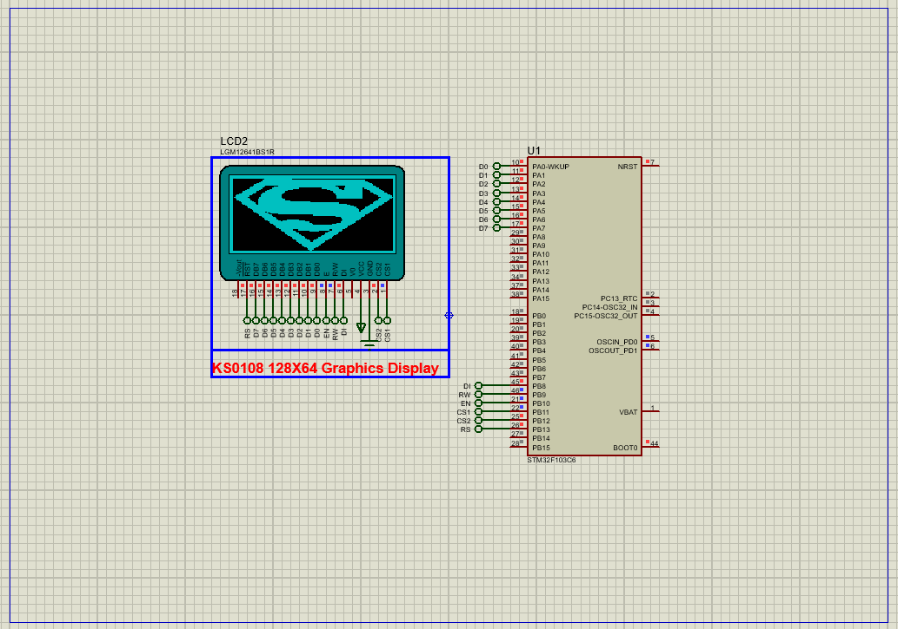

# STM32 KS0108 LCD Integration: Proteus Simulation

This project demonstrates how to interface a **KS0108-based graphical LCD** with an STM32 microcontroller using GPIO pins, with complete Proteus simulation support for validation.

## Hardware Requirements  
  
- **STM32F103C6 Microcontroller**  
- **KS0108 LCD Module** (128×64 pixels)  
- **10kΩ Potentiometer** (Contrast adjustment)  
- **Virtual Terminal** (for debug output)  
- **Proteus 8.15+**  
- **Power Supply (5V)**  

## Circuit Overview  
- **Control Pins**:  
  - RS (PA0): Register Select  
  - RW (PA1): Read/Write  
  - EN (PA2): Enable  
  - CS1/CS2 (PA3/PA4): Chip Selects  
- **Data Bus**: PB0-PB7 (8-bit parallel)  
- **UART1**: PA9-TX for debug output (115200 baud)  

## Software Requirements  
- **STM32CubeMX** (Configuration)  
- **STM32CubeIDE** (Code implementation)  
- **KS0108 Library** (Custom driver)  
- **Proteus 8.15+** (Simulation)  

## Configuration Steps  

### STM32CubeMX Setup  
1. **MCU Selection**: STM32F103C6 (8 MHz clock)  
2. **GPIO**:  
   - PA0-PA4 as outputs (Control pins)  
   - PB0-PB7 as outputs (Data bus)  
3. **UART1**: Asynchronous mode, 115200 baud  
4. **Generate Code** in CubeIDE  

### STM32CubeIDE Implementation  
#### Key Functions:  
1. **LCD Initialization**:  
   - `KS0108_Init()` - Configures timing and startup sequence  
2. **Display Operations**:  
   - `KS0108_Clear()` - Clears entire display  
   - `KS0108_DrawString()` - Renders text at specified position  

### Proteus Simulation  
1. **Components**:  
   - STM32F103C6, KS0108 LCD, Virtual Terminal  
2. **Connections**:  
   - Match all control/data pins  
   - Connect UART1-TX (PA9) to Virtual Terminal  
3. **Simulation**:  
   - Load `.hex` file  
   - Observe debug output and LCD rendering  

## Troubleshooting  
- **Blank Display**: Check contrast voltage (~0.5V) and EN signal timing  
- **Garbled Text**: Verify data bus connections and initialization sequence  
- **UART Issues**: Confirm baud rate (115200) and TX pin (PA9)  

## License  
**MIT License** — Free to use with attribution  

