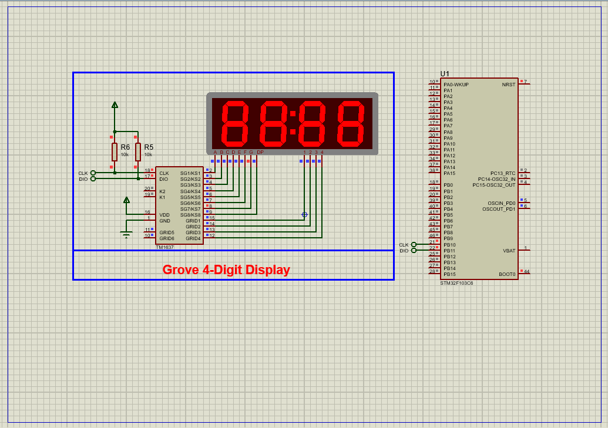

# TM1637 4-Digit Display with STM32: Complete Integration Guide

This project demonstrates how to interface a **TM1637 4-digit 7-segment display** with an STM32 microcontroller using GPIO bit-banging. The system displays numeric data with programmable brightness control and includes full Proteus simulation support.

## Hardware Requirements  
  
- **STM32F103C6 Microcontroller**  
- **TM1637 4-Digit Display Module**  
- **220Ω Resistors** (x4 for segment current limiting)  
- **10kΩ Pull-Up Resistors** (for CLK/DIO lines)  
- **Proteus 8.15+**  
- **Power Supply (5V recommended)**  

## Circuit Overview  
- **TM1637 Interface**:  
  - CLK (PA0) → Display CLK Pin  
  - DIO (PA1) → Display DATA Pin  
- **Power**:  
  - VCC → 5V (for optimal brightness)  
  - GND → Common Ground  
- **Segment Protection**: 220Ω resistors in series with display segments  

## Software Requirements  
- **STM32CubeMX** (for GPIO configuration)  
- **STM32CubeIDE** (for code implementation)  
- **Custom TM1637 Library** (bit-banging driver)  
- **Proteus 8.15+** (for simulation)  

## Configuration Steps  

### STM32CubeMX Setup  
1. **MCU Selection**: STM32F103C6 (8 MHz clock).  
2. **GPIO Configuration**:  
   - PA0 (CLK) and PA1 (DIO) as **Output Push-Pull**  
3. **Generate Code** and open in STM32CubeIDE.  

### STM32CubeIDE Implementation  
#### Key Functions:  
1. **Display Initialization**:  
   -TM1637_Init(); // Configures CLK/DIO timing
2. **Display Operations**: 
   -TM1637_DisplayDecimal(1234, true); // Shows "1234" with colon
   -TM1637_SetBrightness(7); // Maximum brightness
   -....

### Proteus Simulation  
1. **Components**:  
    -STM32F103C6 ,TM1637 Display, Pull-Up Resistors (10kΩ on CLK/DIO)

2. **Connections**:  
    -Match CLK/DIO pins (PA0/PA1)
    -Connect VCC (5V) and GND
3. **Simulation**:  
   - Load `.hex` file  
   - Observe debug output and LCD rendering

## Troubleshooting  
- **Display Not Lighting**:Confirm 5V power supply and Check pull-up resistors on CLK/DIO lines
- **Incorrect Characters**: Validate bit-banging timing (100kHz clock) or Review segment mapping in TM1637_DisplayDecimal()
- **Dim Display**: Increase brightness setting (0-7) and Ensure VCC is 5V

## License  
**MIT License** — Free to use with attribution  