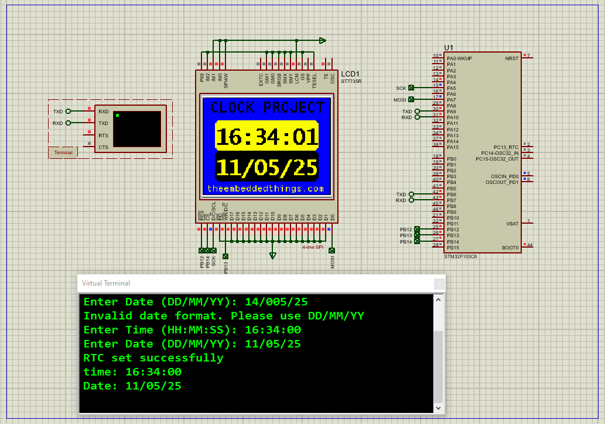

# Real-Time Clock (RTC) with STM32: Displaying Time

This project demonstrates how to implement a **Real-Time Clock (RTC)** using an STM32 microcontroller, displaying time/date on an ST7735 TFT display and allowing configuration via UART. Includes complete Proteus simulation setup.

---

## Hardware Requirements  
  
- **STM32F103C6 Microcontroller**  
- **ST7735 TFT Display** (128x160, SPI interface)  
- **USB-UART Converter** (for time configuration)  
- **Proteus 8.15+**  
- **Power Supply (3.3V)**  

---

## Circuit Overview  
- **RTC Module**: Internal STM32 RTC with 32.768kHz crystal  
- **Display Interface**:  
  - SCK (PA5) → TFT CLK  
  - MOSI (PA7) → TFT DIN  
  - CS (PA4) → TFT CS  
  - DC (PA3) → TFT D/C  
- **UART**: PA9 (TX) → USB-UART RX  

---

## Software Requirements  
- **STM32CubeMX** (Configuration)  
- **STM32CubeIDE** (Code implementation)  
- **ST7735 Library** (for display control)  
- **Proteus 8.15+** (Simulation)  

---

## Configuration Steps  

### STM32CubeMX Setup  
1. **MCU Selection**: STM32F103C6 (72MHz clock)  
2. **RTC Configuration**:  
   - Enable RTC with LSE (32.768kHz crystal)  
   - Set asynchronous prescaler: 127, synchronous: 255  
3. **SPI1**:  
   - Mode: Transmit Only Master  
   - Prescaler: 4 (18MHz baud rate)  
4. **UART1**: 115200 baud, 8-bit data  
5. **Generate Code** in CubeIDE  

---

### STM32CubeIDE Implementation  
#### Key Functions:  
1. **Time/Date Setting**:  
    -Set_RTC_TimeAndDate(); // UART interactive configuration
2. **Display Operations**:
    -ST7735_WriteString(5, 5, "14:30:00", Font_7x10, WHITE, BLACK); // Time display
    -ST7735_WriteString(5, 20, "12/05/24", Font_7x10, WHITE, BLACK); // Date display
3. **Main Loop**:
    -Continuously updates display with current RTC time
    -Sends time data via UART every second

### Proteus Simulation  
1. **Components**:  
    -STM32F103C6 ,ST7735R TFT Display, Virtual Terminal , 32.768kHz Crystal

2. **Connections**:  
    -Match SPI/UART pins
    -Connect crystal to PC14/PC15
3. **Simulation**:  
   - Load `.hex` file  
   - Configure time via terminal ("HH:MM:SS" format)
   -Observe time updates on virtual display

## Troubleshooting  
- **RTC Not Running**:Verify 32.768kHz crystal connections or Check LSE enable bit in RCC registers
- **Display Issues**: Confirm SPI pin mappings and Validate display initialization sequence
- **UART Problems**: Ensure correct baud rate (115200) and Check TX/RX pin connections

## License  
**MIT License** — Free to use with attribution  