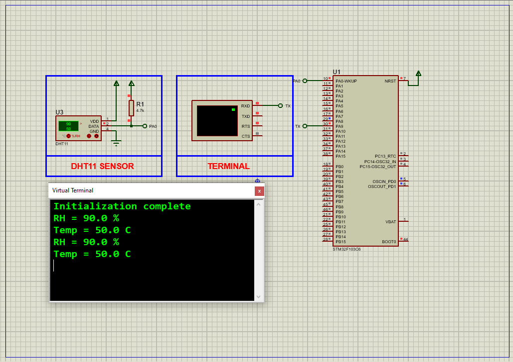

# DHT11 Sensor with STM32: Complete Integration Guide

This project demonstrates how to interface a **DHT11 temperature and humidity sensor** with an STM32 microcontroller using GPIO bit-banging protocol, including real-time data display via UART and full Proteus simulation support.

## Hardware Requirements  
  
- **STM32F103C6 Microcontroller**  
- **DHT11 Sensor Module**  
- **4.7kΩ Pull-Up Resistor** (for data line)  
- **USB-UART Converter** (for serial output)  
- **Proteus 8.15+**  
- **Power Supply (3.3V-5V)**  

## Circuit Overview  
- **Sensor Interface**:  
  - DATA (PA0) → DHT11 Data Pin  
  - VCC → 3.3V/5V  
  - GND → Common Ground  
- **UART Output**:  
  - PA9 (TX) → USB-UART RX (115200 baud)  

## Software Requirements  
- **STM32CubeMX** (for GPIO/TIMER configuration)  
- **STM32CubeIDE** (for code implementation)  
- **Custom DHT11 Library** (bit-banging driver)  
- **Proteus 8.15+** (for simulation)  

## Configuration Steps  

### STM32CubeMX Setup  
1. **MCU Selection**: STM32F103C6 (16MHz clock)  
2. **GPIO Configuration**:  
   - PA0 as **Open-Drain Output** (DATA line)  
3. **TIM1 Configuration**:  
   - Prescaler=15, Counter Period=65535 (for µs delays)  
4. **UART1 Configuration**:  
   - 115200 baud, 8-bit data, no parity  
5. **Generate Code** in CubeIDE  

### STM32CubeIDE Implementation  
#### Key Functions:  
1. **Sensor Initialization**:  void DHT11_Init(); // Configures GPIO and timer
2. **Data Acquisition**: void DHT11_Read(float *temp, float *humidity); // Reads sensor values
3. **UART Output**: printf("Temp: %.1f°C, Humidity: %.1f%%\r\n", temp, humidity);

### Proteus Simulation  
1. **Components**:  
    -STM32F103C6, DHT11, Virtual Terminal
2. **Connections**:  
    -Match DATA pin (PA0)
    -Connect UART1-TX to terminal

3. **Simulation**:  
   - Load `.hex` file  
   - Observe temperature/humidity values in terminal

## Troubleshooting  
**No Sensor Response**:
    -Verify pull-up resistor (4.7kΩ) on DATA line
    -Check power supply (3.3V-5V)
**Incorrect Readings**:
    -Validate timing delays (µs precision)
    -Ensure stable power during transmission
**UART Issues**:
    -Confirm baud rate (115200)

## License  
**MIT License** — Free to use with attribution  