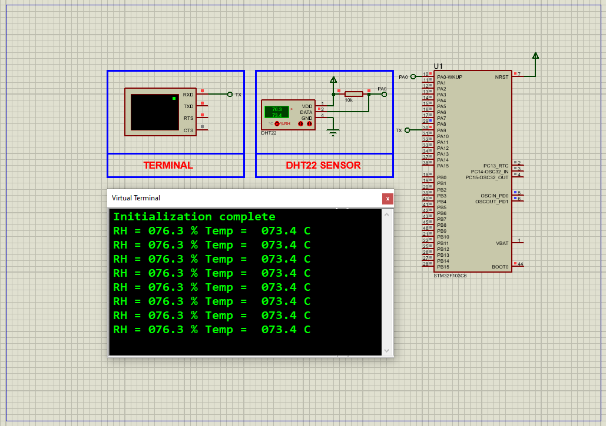

# STM32 with DHT22: Complete Integration Guide

This project demonstrates how to interface a **DHT22 temperature and humidity sensor** with an STM32 microcontroller using a single-wire protocol, featuring high-precision measurements and real-time UART output. Includes full Proteus simulation support.

---

## Hardware Requirements  
  
- **STM32F103C6 Microcontroller**  
- **DHT22 Sensor** (AM2302)  
- **4.7kΩ Pull-Up Resistor** (DATA line)  
- **USB-UART Converter**  
- **Proteus 8.15+**  
- **Power Supply (3.3V-5V)**  

---

## Circuit Overview  
- **Sensor Interface**:  
  - DATA (PA0) → DHT22 Data Pin  
  - VCC → 3.3V/5V  
  - GND → Common Ground  
- **UART Output**:  
  - PA9 (TX) → USB-UART RX (115200 baud)  

---

## Software Requirements  
- **STM32CubeMX** (for GPIO/TIMER configuration)  
- **STM32CubeIDE** (for code implementation)  
- **Custom DHT22 Library** (bit-banging driver)  
- **Proteus 8.15+** (for simulation)  

---

## Configuration Steps  

### STM32CubeMX Setup  
1. **MCU Selection**: STM32F103C6 (16MHz clock)  
2. **GPIO Configuration**:  
   - PA0 as **Open-Drain Output** (DATA line)  
3. **TIM1 Configuration**:  
   - Prescaler=15, Counter Period=65535 (1µs resolution)  
4. **UART1 Configuration**:  
   - 115200 baud, 8-bit data, no parity  
5. **Generate Code** in CubeIDE  

---

### STM32CubeIDE Implementation  
#### Key Functions:  
1. **Sensor Initialization**:  
    -void DHT22_Init(); // Configures GPIO and TIM1 for µs delays
2. **Data Acquisition**:
    -void DHT22_Read(float *temp, float *humidity); // Reads 40-bit data
3. **Checksum Validation**:
    -if (checksum == (RH_H + RH_L + T_H + T_L)) // Data integrity check
4. **UART Output**:
    -printf("Temp: %.1f°C | Humidity: %.1f%%\r\n", temp, humidity);

## Proteus Simulation  
1. **Components**:  
    -STM32F103C6, DHT22, Virtual Terminal

2. **Connections**:  
    -DATA (PA0) → DHT22 DATA
    -UART1-TX (PA9) → Terminal RX
3. **Simulation**:  
   - UART1-TX (PA9) → Terminal RX
   - Observe real-time data in terminal

## Troubleshooting  
- **Sensor Not Responding**:Verify 4.7kΩ pull-up resistor on DATA line or Check power supply (3.3V-5V)
- **Incorrect Values**: 
        -Validate µs-level timing (DHT22 requires stricter timing than DHT11)
        -Ensure checksum validation is implemented
- **Negative Temperatures**: Handle sign bit in temperature data (DHT22 supports -40°C)

## License  
**MIT License** — Free to use with attribution  