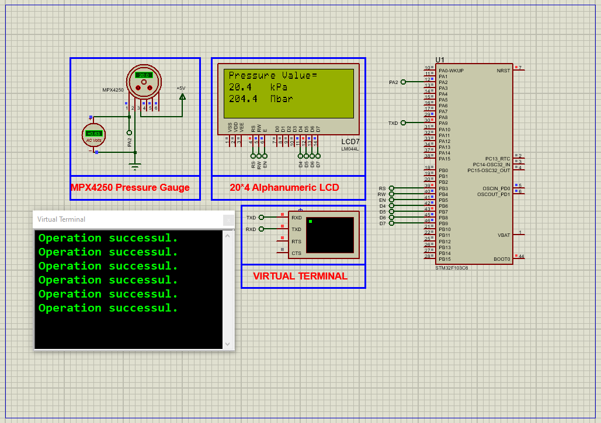

# Integrating STM32 ADC with MPX4250AP Pressure Gauge: Complete Guide

This project demonstrates how to interface an **MPX4250AP pressure sensor** with an STM32 microcontroller using ADC, displaying pressure values on an LCD and transmitting data via UART. Includes full Proteus simulation.

---

## Hardware Requirements  
  
- **STM32F103C6 Microcontroller**  
- **MPX4250AP Pressure Sensor** (0-250kPa range)  
- **20×4 LCD Display** (HD44780 compatible)  
- **USB-UART Converter**  
- **Proteus 8.15+**  
- **Power Supply (5V)**  

---

## Circuit Overview  
- **Sensor Interface**:  
  - OUT → PA2 (ADC1_IN2)  
  - VSS → GND, VS → 5V  
- **LCD Connection**:  
  - RS (PB3), EN (PB4), RW (PB5)  
  - D4-D7 (PB6-PB9)  
- **UART Output**:  
  - PA9 (TX) → USB-UART RX (115200 baud)  

---

## Software Requirements  
- **STM32CubeMX** (for peripheral configuration)  
- **STM32CubeIDE** (for code implementation)  
- **LiquidCrystal Library** (for LCD control)  
- **Proteus 8.15+** (for simulation)  

---

## Configuration Steps  

### STM32CubeMX Setup  
1. **MCU Selection**: STM32F103C6 (8MHz clock)  
2. **ADC1 Configuration**:  
   - Channel IN2 (PA2), Continuous Conversion Mode  
   - 12-bit resolution, 1.5 cycles sampling time  
3. **GPIO**:  
   - PB3-PB9 as outputs (LCD control)  
4. **UART1**: 115200 baud, 8-bit data  
5. **Generate Code** in CubeIDE  

---

### STM32CubeIDE Implementation  
#### Key Functions:  
1. **Pressure Calculation**:  
    -float pressure_kPa = (adc_value * 5.0/4095 * 50.8) + 0.25; // MPX4250AP transfer function
2. **LCD Output:**:
    -lcd.setCursor(0,1); 
    -lcd.print(pressure_kPa); 
    -lcd.print(" kPa");
3. **UART Transmission:**:
    -sprintf(uartMsg, "Pressure: %.1f kPa\r\n", pressure_kPa);
    -HAL_UART_Transmit(&huart1, (uint8_t*)uartMsg, strlen(uartMsg), 100);

### Proteus Simulation  
1. **Components**:  
    -STM32F103C6, MPX4250AP, LCD2004, Virtual Terminal

2. **Connections**:  
    -Match ADC/LCD/UART pins
    -Connect sensor output to PA2
3. **Simulation**:  
   -Load `.hex` file  
   -Observe pressure values on LCD and terminal

## Troubleshooting  
- **No ADC Reading**:Verify sensor output voltage (0.25V-4.87V) and  Check ADC channel configuration 
- **LCD Not Working**: Confirm RW pin is grounded and Adjust contrast potentiometer
- **UART Issues**: Ensure correct baud rate (115200) and Check TX/RX pin connections

## License  
**MIT License** — Free to use with attribution  