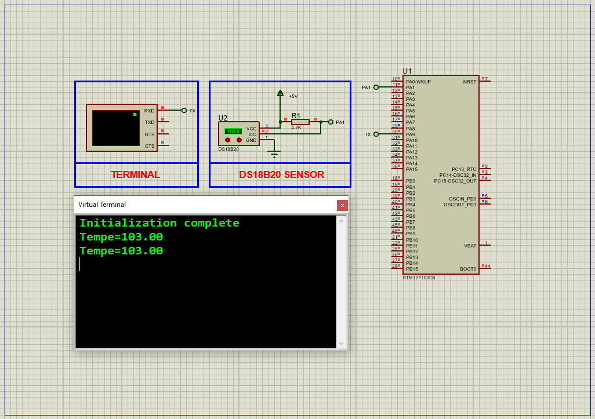

# STM32 DS18B20 Integration: Complete Temperature Sensing Guide

This project demonstrates how to interface a **DS18B20 digital temperature sensor** with an STM32 microcontroller using the 1-Wire protocol, displaying real-time temperature data via UART. Includes full Proteus simulation support.

## Hardware Requirements  
  
- **STM32F103C6 Microcontroller**  
- **DS18B20 Temperature Sensor**  
- **4.7kΩ Pull-Up Resistor** (DATA line)  
- **LED** (Status indicator)  
- **USB-UART Converter**  
- **Proteus 8.15+**  
- **Power Supply (3.3V-5V)**  

## Circuit Overview  
- **Sensor Interface**:  
  - DATA (PA1) → DS18B20 DATA with 4.7kΩ pull-up  
  - VDD → 3.3V/5V (or parasite power mode)  
  - GND → Common Ground  
- **UART Output**:  
  - PA9 (TX) → USB-UART RX (115200 baud)  
- **Status LED**:  
  - PC13 → LED anode  

## Software Requirements  
- **STM32CubeMX** (for GPIO/UART configuration)  
- **STM32CubeIDE** (for code implementation)  
- **Custom 1-Wire Library** (bit-banging driver)  
- **Proteus 8.15+** (for simulation)  

## Configuration Steps  

### STM32CubeMX Setup  
1. **MCU Selection**: STM32F103C6 (16MHz clock)  
2. **GPIO Configuration**:  
   - PA1 as **Open-Drain Output** (DATA line)  
   - PC13 as **Output** (LED)  
3. **UART1 Configuration**:  
   - 115200 baud, 8-bit data, no parity  
4. **Generate Code** in CubeIDE  

### STM32CubeIDE Implementation  
#### Key Functions:  
1. **1-Wire Protocol**:  
    - onewire_reset(); // Initialize communication
    - onewire_Write(0xCC); // Skip ROM
    - onewire_Write(0x44); // Start conversion.
2. **Temperature Reading:**:
    - float temp = (raw_temp_msb << 8 | raw_temp_lsb) / 16.0;
3. **UART Output:**:
    - printf("Temperature: %.2f°C\r\n", temp);

### Proteus Simulation  
1. **Components**:  
    - STM32F103C6, DS18B20, Virtual Terminal

2. **Connections**:  
    - DATA (PA1) → DS18B20 with pull-up resistor
    - UART1-TX (PA9) → Terminal RX
3. **Simulation**:  
   - Load `.hex` file  
   - Observe time updates on virtual display
 
## Troubleshooting  
- **RTC Not Running**:Verify 32.768kHz crystal connections or Check LSE enable bit in RCC registers
- **Display Issues**: Confirm SPI pin mappings and Validate display initialization sequence
- **UART Problems**: Ensure correct baud rate (115200) and Check TX/RX pin connections

## License  
**MIT License** — Free to use with attributi