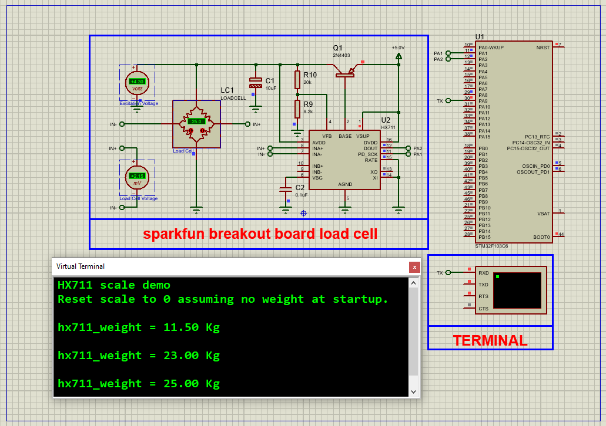

# HX711 Load Cell Amplifier with STM32: Complete Integration Guide

This project demonstrates how to interface a **HX711 24-bit ADC** with an STM32 microcontroller for precise weight measurements using load cells, featuring real-time data display via UART and full Proteus simulation support.

---

## Hardware Requirements  
  
- **STM32F103C6 Microcontroller**  
- **HX711 Load Cell Amplifier**  
- **Strain Gauge Load Cell** (e.g., 5kg capacity)  
- **USB-UART Converter**  
- **Proteus 8.15+**  
- **Power Supply (5V)**  

---

## Circuit Overview  
- **HX711 Interface**:  
  - DT (PA1) → STM32 Data Input  
  - SCK (PA2) → STM32 Clock Output  
  - VCC → 5V, GND → Common Ground  
- **Load Cell Connection**:  
  - E+ → Red, E- → Black  
  - A+ → White, A- → Green  
- **UART Output**:  
  - PA9 (TX) → USB-UART RX (9600 baud)  

---

## Software Requirements  
- **STM32CubeMX** (for GPIO/TIMER configuration)  
- **STM32CubeIDE** (for code implementation)  
- **Custom HX711 Library** (SPI-like protocol)  
- **Proteus 8.15+** (for simulation)  

---

## Configuration Steps  

### STM32CubeMX Setup  
1. **MCU Selection**: STM32F103C6 (8MHz clock)  
2. **GPIO Configuration**:  
   - PA1 as **Input** (DT)  
   - PA2 as **Output** (SCK)  
3. **TIM1 Configuration**:  
   - Prescaler=0, Counter Period=65535 (µs delays)  
4. **UART1 Configuration**:  
   - 9600 baud, 8-bit data, no parity  
5. **Generate Code** in CubeIDE  

---

### STM32CubeIDE Implementation  
#### Key Functions:  
1. **HX711 Initialization**:  
    -HX711_Init(); // Sets gain to 128 and tares the scale
2. **Weight Reading:**:
    -int32_t raw_val = HX711_Read(); // Raw 24-bit ADC value
    -float weight = (raw_val - offset) / scale_factor; // Calibrated weight
3. **UART Output:**:
    -printf("Weight: %.2f g\r\n", weight);

### Proteus Simulation  
1. **Components**:  
    -STM32F103C6, HX711, Virtual Terminal, DC Voltmeter
2. **Connections**:  
    -Match DT/SCK pins (PA1/PA2)
    -Simulate load cell with variable voltage source
3. **Simulation**:  
   - Load `.hex` file  
   - Adjust voltage to simulate weight changes (0-5V ≈ 0-5kg)

## Troubleshooting  
- **No Data from HX711**:Verify 5V power to HX711 and Check DT/SCK connections (PA1/PA2)
- **Unstable Readings**: Ensure stable power supply and Add 100nF capacitor between HX711 VCC-GND
- **UART Issues**: Confirm baud rate (9600) and TX pin (PA9)

## License  
**MIT License** — Free to use with attributi