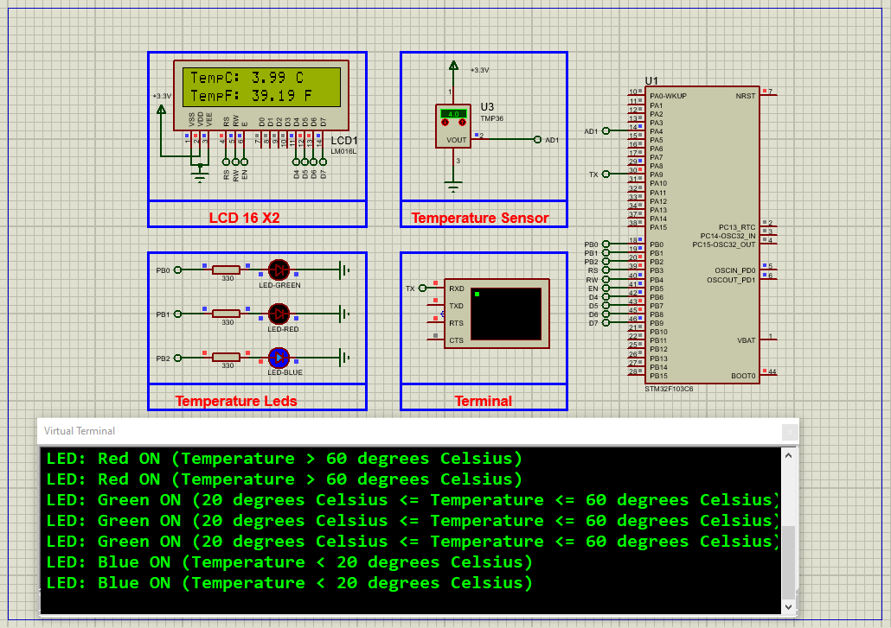

# STM32 TMP36 Temperature Sensor Integration Guide

Complete low-level interface for TMP36 analog temperature sensor with STM32F103C6, featuring UART monitoring and LED alerts.

## 📋 Key Features
- Analog temperature sensing (-40°C to +125°C)
- Real-time UART output (115200 baud)
- Visual LED indicators (Red/Green/Blue)
- Proteus 8 simulation support
- HAL library implementation

## 🔧 Hardware Setup
  

| Component | Connection |
|-----------|------------|
| TMP36 VCC | 3.3V |
| TMP36 GND | GND |
| TMP36 VOUT | PA4 (ADC1_IN4) |
| Red LED | PB1 |
| Green LED | PB0 |
| Blue LED | PB2 |
| UART TX | PA9 (115200 baud) |

## ⚙️ STM32CubeMX Configuration
1. **Clock**: 8MHz HSI
2. **ADC1**:
   - Channel 4 (PA4)
   - 12-bit resolution
3. **GPIO**:
   - PB0/PB1/PB2 as Output
4. **UART1**:
   - 115200 baud, 8-bit, No parity

## 💻 Firmware Implementation
- float voltage = ((HAL_ADC_GetValue(&hadc1)*3.3f/4095.0f - 0.5f)*1000;
- float temp_C = voltage/10.0f;

### Proteus Simulation  
1. **Components**:  
    -STM32F103C6 ,TMP36 ,Virtual Terminal

2. **Connections**:  
    -TMP36 output → PA4
    -LEDs → PB0/PB1/PB2
3. **Simulation**:  
   - Load `.hex` file  
   - Observe time updates on virtual display

## Troubleshooting  
- **No ADC readings**:Check 3.3V power to TMP36
- **Wrong temperature**: Verify VOUT formula: (V-0.5)*100
- **UART not working**: Confirm 115200 baud rate

## License  
**MIT License** — Free to use with attribution  