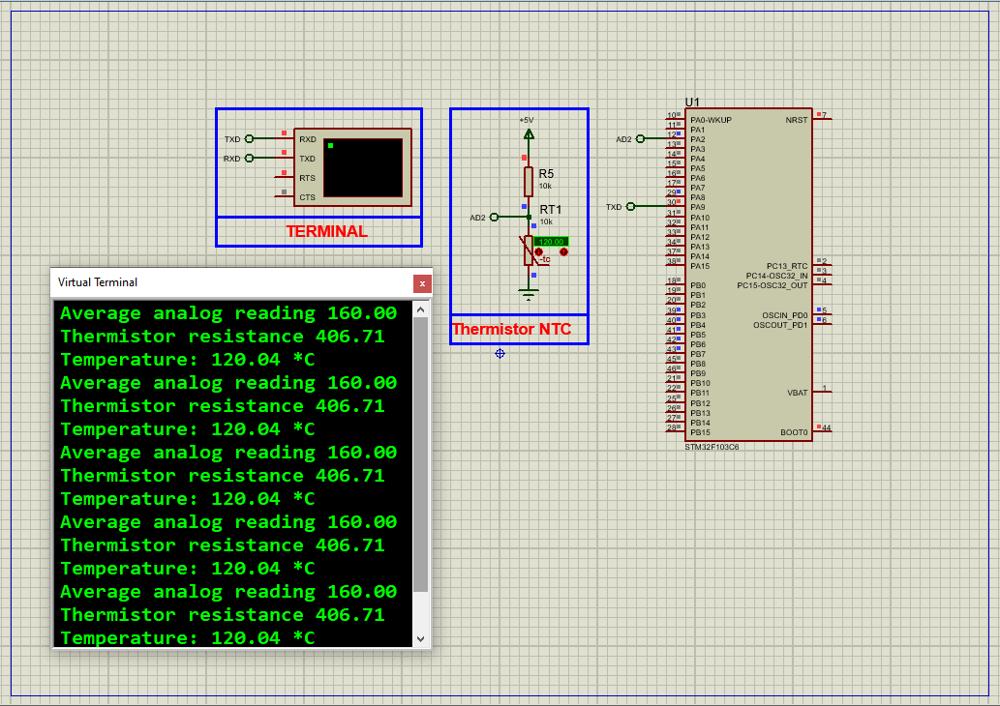

# STM32 Thermistor ADC: Complete Temperature Sensing Guide

This project demonstrates how to interface an **NTC thermistor** with an STM32 microcontroller using ADC for precise temperature measurement, featuring real-time UART output and full Proteus simulation support.

---

## Hardware Requirements  
  
- **STM32F103C6 Microcontroller**  
- **10kΩ NTC Thermistor (B=3950)**  
- **10kΩ Precision Resistor** (voltage divider)  
- **100nF Capacitor** (noise filtering)  
- **Proteus 8.15+**  
- **Power Supply (3.3V)**  

---

## Circuit Overview  
- **Thermistor Interface**:  
  - 3.3V → 10kΩ Resistor → PA5 (ADC1_IN5)  
  - NTC Thermistor → GND  
- **Noise Reduction**:  
  - 100nF capacitor between PA5 and GND  
- **UART Output**:  
  - PA9 (TX) → USB-UART RX (115200 baud)  

---

## Software Requirements  
- **STM32CubeMX** (for ADC/UART configuration)  
- **STM32CubeIDE** (for code implementation)  
- **Proteus 8.15+** (for simulation)  
- **Math.h library** (for Steinhart-Hart calculations)  

---

## Configuration Steps  

### STM32CubeMX Setup  
1. **MCU Selection**: STM32F103C6 (8MHz clock)  
2. **ADC Configuration**:  
   - ADC1 Channel 5 (PA5) enabled  
   - 12-bit resolution, right alignment  
3. **UART1 Configuration**:  
   - 115200 baud, 8-bit data, no parity  
4. **Generate Code** in CubeIDE  

---

### STM32CubeIDE Implementation  
#### Key Functions:  
1. **Thermistor Reading**:  
    - float Read_Thermistor() 
2. **UART Output**:
    -printf("Temperature: %.2f°C\r\n", Read_Thermistor());
3. **Continuous Monitoring**:
    -float temp = Read_Thermistor();

### Proteus Simulation  
1. **Components**:  
    -STM32F103C6 , NTC Thermistor, 10kΩ Resistor

2. **Connections**:  
    -Match voltage divider circuit exactly
    -CConnect UART TX to virtual terminal
3. **Simulation**:  
   - Load `.hex` file  
   - Adjust thermistor resistance to simulate temperature changes
   - Monitor terminal output

## Troubleshooting  
- **No ADC Readings**:Verify 3.3V power and check PA5 connection
- **Incorrect Temperatures**: Confirm β-coefficient (3950 for standard thermistors)
- **Noisy Readings**: Add 100nF capacitor at ADC input
- **UART Issues**:Verify 115200 baud rate and PA9 connection

## License  
**MIT License** — Free to use with attribution  