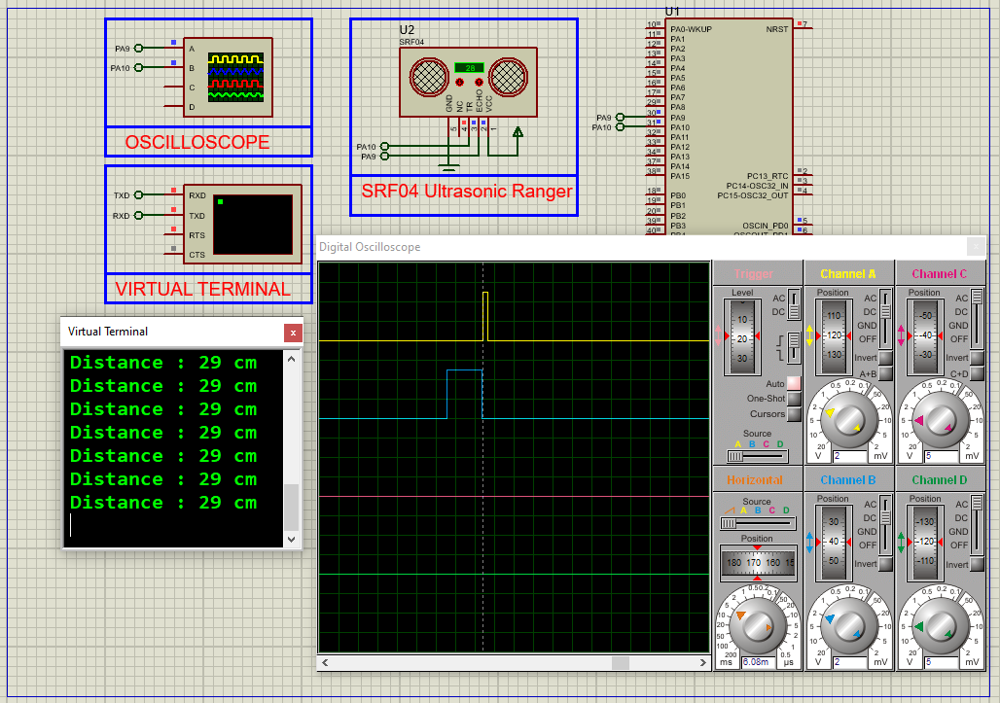

# STM32 HC-SR04 Ultrasonic Sensor: Complete Integration Guide

This project demonstrates how to interface an **HC-SR04 ultrasonic sensor** with an STM32 microcontroller using TIMER input capture for precise distance measurement, featuring real-time UART output and full Proteus simulation support.

---

## Hardware Requirements  
  
- **STM32F103C6 Microcontroller**  
- **HC-SR04 Ultrasonic Sensor**  
- **USB-UART Converter**  
- **Proteus 8.15+**  
- **Power Supply (5V for sensor, 3.3V for STM32)**  

---

## Circuit Overview  
- **HC-SR04 Interface**:  
  - VCC → 5V  
  - GND → Common Ground  
  - TRIG → PA10 (GPIO Output)  
  - ECHO → PA8 (TIM1 CH1 Input Capture)  
- **UART Output**:  
  - PA9 (TX) → USB-UART RX (115200 baud)  

---

## Software Requirements  
- **STM32CubeMX** (for TIMER/GPIO/UART configuration)  
- **STM32CubeIDE** (for code implementation)  
- **Proteus 8.15+** (for simulation)  

---

## Configuration Steps  

### STM32CubeMX Setup  
1. **MCU Selection**: STM32F103C6 (16MHz clock)  
2. **GPIO Configuration**:  
   - PA10 as **Output** (TRIG)  
3. **TIM1 Configuration**:  
   - Channel 1 as Input Capture Direct Mode  
   - Prescaler=16-1, Counter Period=65535  
4. **UART1 Configuration**:  
   - 115200 baud, 8-bit data, no parity  
5. **Generate Code** in CubeIDE  

---

### STM32CubeIDE Implementation  
#### Key Functions:  
1. **Trigger Pulse Generation**:  
    - void HCSR04_Trigger() 
2. **Input Capture Callback:**:
    - void HAL_TIM_IC_CaptureCallback(TIM_HandleTypeDef *htim)
3. **Main Loop**:
    - HCSR04_Trigger();
    - HAL_UART_Transmit(&huart1, (uint8_t*)msg, sprintf(msg,"Distance: %d cm\r\n",Distance), 100);

### Proteus Simulation  
1. **Components**:  
    - STM32F103C6 ,SRF04 ,Virtual Terminal (115200 baud)

2. **Connections**:  
    - Match TRIG/ECHO pins (PA10/PA8)
    - Connect UART TX to terminal
3. **Simulation**:  
   - Load `.hex` file  
   - Adjust SRF04 distance parameter
   - Monitor terminal output

## Troubleshooting  
- **No distance readings**:Verify 5V power to HC-SR04
- **Incorrect values**: Check TIM1 prescaler configuration
- **ECHO signal noise**: Add 100nF capacitor near sensor
- **UART not working**: Confirm 115200 baud rate

## License  
**MIT License** — Free to use with attribution  