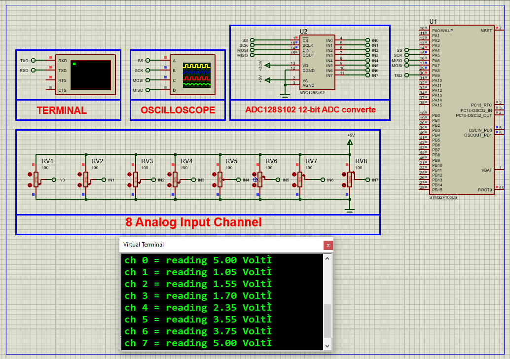

# STM32 ADC128S102: Complete SPI Interface Guide

This project demonstrates how to interface the **ADC128S102 12-bit ADC** with an STM32 microcontroller using SPI for high-precision analog measurements, featuring multi-channel data acquisition and real-time UART monitoring.

---

## Hardware Requirements  
  
- **STM32F103C6 Microcontroller**  
- **ADC128S102 12-bit ADC**  
- **10kΩ Potentiometers** (x8 for analog inputs)  
- **0.1μF Decoupling Capacitors** (x2)  
- **Proteus 8.15+**  
- **Power Supply (3.3V)**  

---

## Circuit Overview  
- **SPI Interface**:  
  - CS → PA4 (GPIO Output)  
  - SCK → PA5 (SPI1 CLK)  
  - MISO → PA6 (SPI1 MISO)  
  - MOSI → PA7 (SPI1 MOSI)  
- **Analog Inputs**:  
  - CH0-CH7 → 0-3.3V signals  
- **UART Output**:  
  - PA9 (TX) → USB-UART RX (115200 baud)  

---

## Software Requirements  
- **STM32CubeMX** (for SPI/GPIO configuration)  
- **STM32CubeIDE** (for code implementation)  
- **Proteus 8.15+** (for simulation)  

---

## Configuration Steps  

### STM32CubeMX Setup  
1. **MCU Selection**: STM32F103C6 (8MHz clock)  
2. **SPI1 Configuration**:  
   - Full-Duplex Master  
   - 8-bit data size  
   - CPOL=Low, CPHA=1Edge  
   - Prescaler=32 (250kHz clock)  
3. **GPIO Configuration**:  
   - PA4 as Output (Chip Select)  
4. **UART1 Configuration**:  
   - 115200 baud, 8-bit data  
5. **Generate Code** in CubeIDE  

---

### STM32CubeIDE Implementation  
#### Key Functions:  
1. **SPI Initialization**:  
    - void ADC128S102_Init()
2. **Channel Reading**:
    - uint16_t Read_ADC_Channel(uint8_t channel) 
3. **Main Loop**:
    - uint16_t val = Read_ADC_Channel(ch);
    - printf("CH%d: %.2fV\r\n", ch, (val * 3.3f / 4095));

### Proteus Simulation  
1. **Components**:  
    - STM32F103C6 ,ADC128S102 ,POT-HG (x8) ,Virtual Terminal 
2. **Connections**:  
    - Match SPI pins (PA4-PA7)
    - Connect pots to CH0-CH7
3. **Simulation**:  
   - Load `.hex` file  
   - Adjust potentiometers
   - Monitor terminal output

## Troubleshooting  
- **No SPI communication**:Verify CS pin activity with logic analyzer
- **Incorrect readings**: Check reference voltage (3.3V)
- **Channel crosstalk**: Add 0.1μF caps between CHx and GND
- **Data corruption**: Reduce SPI clock speed

## License  
**MIT License** — Free to use with attribution  