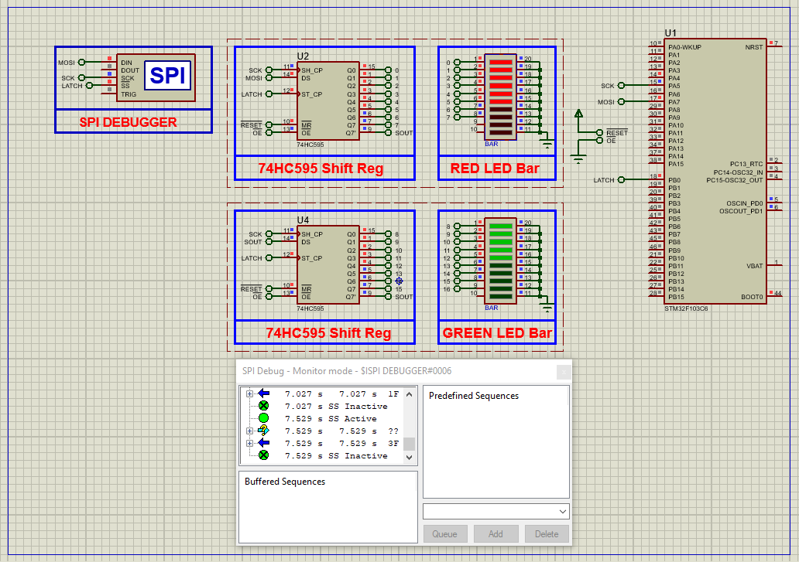

# STM32 LED Bar-Graph Display with 74HC595: Complete Integration Guide

This project demonstrates how to interface a **74HC595 shift register** with an STM32 microcontroller to drive LED bar-graph displays, featuring cascadable outputs and programmable patterns.

---

## Hardware Requirements  
  
- **STM32F103C6 Microcontroller**  
- **74HC595 Shift Register IC**  
- **10-segment LED Bar Graph Display**  
- **220Ω Current-Limiting Resistors** (x10)  
- **0.1μF Decoupling Capacitor**  
- **Proteus 8.15+**  
- **Power Supply (5V for LEDs, 3.3V for STM32)**  

---

## Circuit Overview  
- **SPI Interface**:  
  - DS (Serial Data) → PA7 (MOSI)  
  - SHCP (Clock) → PA5 (SCK)  
  - STCP (Latch) → PA4 (GPIO)  
- **Power**:  
  - VCC → 5V (LED power)  
  - GND → Common Ground  
- **LED Protection**:  
  - 220Ω resistors in series with each LED  

---

## Software Requirements  
- **STM32CubeMX** (for SPI/GPIO configuration)  
- **STM32CubeIDE** (for code implementation)  
- **Proteus 8.15+** (for simulation)  

---

## Configuration Steps  

### STM32CubeMX Setup  
1. **MCU Selection**: STM32F103C6 (8MHz clock)  
2. **SPI1 Configuration**:  
   - Master Transmit Only  
   - 8-bit data size  
   - MSB First  
   - Baud Rate Prescaler: 32 (250kHz)  
3. **GPIO Configuration**:  
   - PA4 as Output (Latch Pin)  
4. **Generate Code** in CubeIDE  

---

### STM32CubeIDE Implementation  
#### Key Functions:  
1. **Shift Register Control**:  
    - void Write_74HC595(uint8_t data) 
2. **SPI1 Configuration**:  
   - Full-Duplex Master  
   - 8-bit data size  
   - CPOL=Low, CPHA=1Edge  
   - Prescaler=32 (250kHz clock)  
3. **GPIO Configuration**:  
   - PA4 as Output (Chip Select)  
4. **UART1 Configuration**:  
   - 115200 baud, 8-bit data  
5. **Generate Code** in CubeIDE  

---

### STM32CubeIDE Implementation  
#### Key Functions:  
1. **SPI Initialization**:  
    - void ADC128S102_Init()
2. **Bar Graph Patterns**:
    - const uint8_t patterns[10] 
    - Write_74HC595(patterns[level-1])
3. **Main Loop**:
    - Display_Level(i);

### Proteus Simulation  
1. **Components**:  
    - STM32F103C6 ,74HC595 ,LED-BARGRAPH ,Virtual Terminal 
2. **Connections**:  
    - MMatch SPI pins (PA4-PA7)
    - Connect LEDs to 74HC595 outputs
3. **Simulation**:  
   - Load `.hex` file  
   - Observe LED animation

## Troubleshooting  
- **LEDs not lighting**:Verify 5V power to 74HC595
- **Incorrect pattern**: Check SPI bit order (MSB first)
- **Flickering display**: Increase latch pulse width
- **Overheating IC**: Add current-limiting resistors

## License  
**MIT License** — Free to use with attribution  