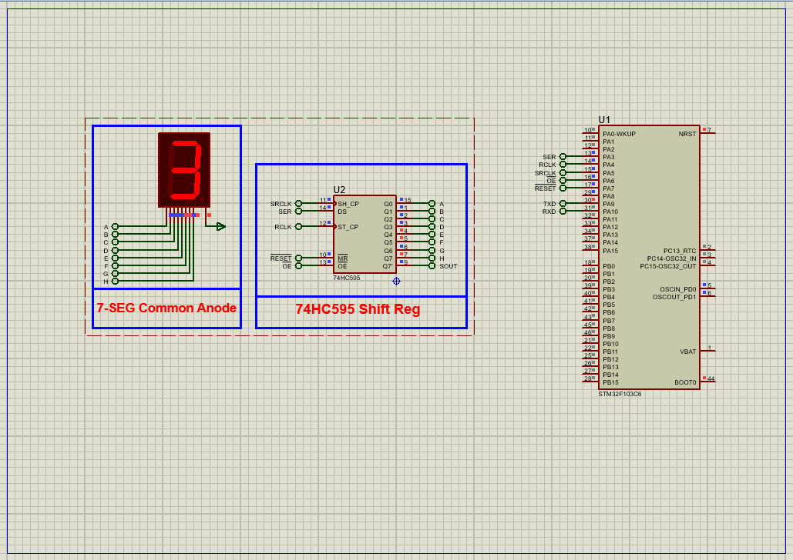

# STM32 UART & 74HC595 7-Segment Display: Complete Control Guide

This project demonstrates how to interface **74HC595 shift registers** with an STM32 microcontroller to drive 7-segment displays via UART commands, featuring cascadable outputs and digit cycling functionality.

---

## Hardware Requirements  
  
- **STM32F103C6 Microcontroller**  
- **74HC595 Shift Register IC**  
- **Common Anode 7-Segment Display**  
- **220Ω Current-Limiting Resistors** (x8)  
- **USB-UART Converter**  
- **Proteus 8.15+**  
- **Power Supply (5V for display, 3.3V for STM32)**  

---

## Circuit Overview  
- **Shift Register Interface**:  
  - SER (DS) → PA3 (Serial Data)  
  - RCLK (STCP) → PA4 (Latch)  
  - SRCLK (SHCP) → PA5 (Clock)  
  - OE → PA6 (Output Enable)  
  - SRCLR → PA7 (Reset)  
- **7-Segment Connections**:  
  - Q0-Q7 → a-g segments + decimal point  
- **UART Interface**:  
  - PA9 (TX) → USB-UART RX (115200 baud)  

---

## Software Requirements  
- **STM32CubeMX** (for GPIO/UART configuration)  
- **STM32CubeIDE** (for code implementation)  
- **Proteus 8.15+** (for simulation)  

---

## Configuration Steps  

### STM32CubeMX Setup  
1. **MCU Selection**: STM32F103C6 (72MHz clock)  
2. **GPIO Configuration**:  
   - PA3-PA7 as Outputs (74HC595 control)  
   - User Labels: SER, RCLK, SRCLK, OE, SRCLR  
3. **UART1 Configuration**:  
   - 115200 baud, 8-bit data, no parity  
4. **Generate Code** in CubeIDE  

---

### STM32CubeIDE Implementation  
#### Key Functions:  
1. **Shift Register Control**:  
    - void Write_7Segment(uint8_t digit) 
2. **SPI1 Configuration**:  
   - Full-Duplex Master  
   - 8-bit data size  
   - CPOL=Low, CPHA=1Edge  
   - Prescaler=32 (250kHz clock)  
3. **GPIO Configuration**:  
   - PA4 as Output (Chip Select)  
4. **UART1 Configuration**:  
   - 115200 baud, 8-bit data  
5. **Generate Code** in CubeIDE  

---

### STM32CubeIDE Implementation  
#### Key Functions:  
1. **SPI Initialization**:  
    - void ADC128S102_Init()
2. **UART Command Handler**:
    - void HAL_UART_RxCpltCallback(UART_HandleTypeDef *huart)
3. **Main Loop**:
    - Write_7Segment(i);

### Proteus Simulation  
1. **Components**:  
    - STM32F103C6 ,74HC595 ,7SEG-COM-ANODE ,Virtual Terminal 
2. **Connections**:  
    - Match GPIO pins (PA3-PA7)
    - Connect UART to terminal
3. **Simulation**:  
   - Load `.hex` file  
   - Send digits 0-9 via terminal
   - Observe display output

## Troubleshooting  
- **No display**:Verify OE pin is LOW
- **Incorrect segments**: Check 7-segment common anode/cathode type
- **Ghosting**: Add 100nF capacitor to VCC
- **UART not responding**: Confirm baud rate (115200)

## License  
**MIT License** — Free to use with attribution  
 