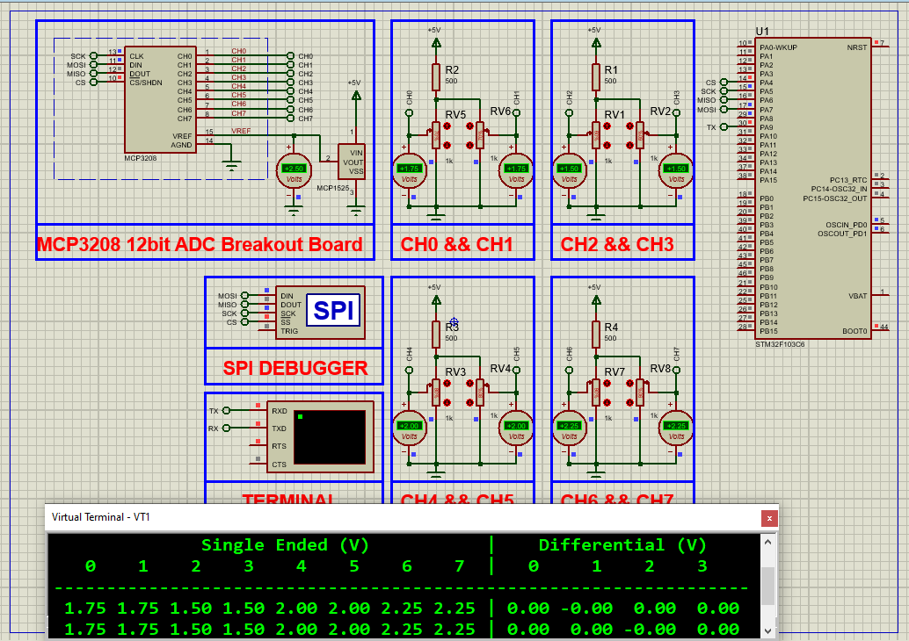

# MCP3008 SPI Interface STM32: A Step-by-Step Guide  

This project demonstrates how to interface the **MCP3008 10-bit ADC** with an STM32 microcontroller using SPI for precise analog signal acquisition.  

---

## Hardware Requirements  
  
- **STM32F103C6 Microcontroller**  
- **MCP3008 8-Channel ADC**  
- **Potentiometer/LDR/Sensor** (Analog input source)  
- **3.3V/5V Power Supply**  
- **Proteus 8.15+** (for simulation)  
- **Breadboard & Jumper Wires**  

---

## Circuit Overview  
### SPI Connections:  
- **SCLK** → PB3 (SPI1 Clock)  
- **MISO** → PB4 (SPI1 MISO)  
- **MOSI** → PB5 (SPI1 MOSI)  
- **CS** → PA8 (Chip Select)  
### Analog Input:  
- **CH0** → Potentiometer output  
- **VREF** → 3.3V (for 0-3.3V range)  

---

## Software Requirements  
- **STM32CubeMX** (for SPI/GPIO configuration)  
- **STM32CubeIDE** (for firmware development)  
- **Proteus 8.15+** (simulation)  

---

## Configuration Steps  

### STM32CubeMX Setup  
1. **MCU Selection**: STM32F103C6 (72MHz clock)  
2. **SPI1 Configuration**:  
   - Mode: Full-Duplex Master  
   - Prescaler: 32 (2.25MHz SPI clock)  
   - CPOL: Low, CPHA: 1 Edge  
3. **GPIO Configuration**:  
   - PA8 → Output (Chip Select)  
4. **Generate Code** in CubeIDE  

---

### STM32CubeIDE Implementation  
#### Key Functions:  
1. **SPI Initialization**:  
    - void MCP3008_Init(void) 
2. **Read ADC Channel:**:
    - uint16_t Read_ADC_Channel(uint8_t channel) 
3. **Main Loop**:
    -  uint16_t adc_value = MCP3008_Read(0);

### Proteus Simulation  
1. **Components**:  
    - STM32F103C6, MCP3008, POT-HG, DC Voltmeter
2. **Connections**:  
    - Match SPI pins (PB3-PB5, PA8)
    - Connect POT to MCP3008 CH0
3. **Simulation**:  
   - Load `.hex` file  
   - Adjust potentiometers

## Troubleshooting  
- **No SPI communication**:Verify CS pin toggling , Check CPOL/CPHA settings match MCP3008
- **Incorrect ADC Values**: Ensure VREF matches power supply (3.3V/5V) , Confirm channel selection bits (0x08| channel)

## License  
**MIT License** — Free to use with attribution  
