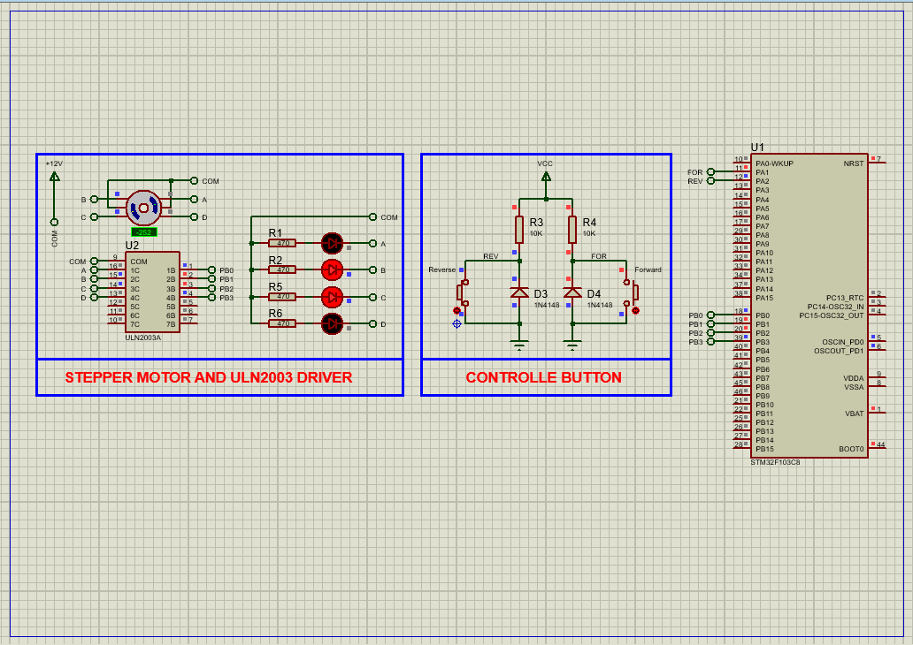

# STM32 Stepper Motor Control with ULN2003 Driver  

This project demonstrates precise **full-step/half-step control** of a 28BYJ-48 stepper motor using an STM32 microcontroller and ULN2003 driver, ideal for robotics and automation applications.  

---

## Hardware Requirements  
  
- **STM32F103C6 Microcontroller**  
- **28BYJ-48 Unipolar Stepper Motor**  
- **ULN2003 Driver Module**  
- **5V Power Supply** (for motor)  
- **3.3V Power Supply** (for STM32)  
- **Tactile Buttons (x2)** (for direction control)  
- **Proteus 8.15+** (for simulation)  

---

## Circuit Overview  
### Motor Connections:  
- **IN1-IN4** → PB0-PB3 (Coil control)  
- **COM** → 5V (Motor power)  
### Direction Control:  
- **FORWARD Button** → PA1  
- **REVERSE Button** → PA2  

---

## Software Requirements  
- **STM32CubeMX** (for GPIO configuration)  
- **STM32CubeIDE** (for firmware development)  
- **Proteus 8.15+** (simulation)  

---

## Configuration Steps  

### STM32CubeMX Setup  
1. **MCU Selection**: STM32F103C6 (16MHz clock)  
2. **GPIO Configuration**:  
   - PB0-PB3 → Outputs (Coil control)  
   - PA1-PA2 → Inputs (Button inputs with pull-up)  
3. **Generate Code** in CubeIDE  

---

### STM32CubeIDE Implementation  
#### Key Functions:  
1. **Stepping Sequences**:  
    - const uint8_t full_step[4] = {0x09, 0x0C, 0x06, 0x03}; 
    - const uint8_t half_step[8] = {0x08, 0x0C, 0x04, 0x06, 0x02, 0x03, 0x01, 0x09};
2. **Motor Control Function**:
    - void Step_Motor(uint8_t direction)
3. **Main Loop with Button Control:**:
    - HAL_GPIO_ReadPin(FORWARD_GPIO_Port, FORWARD_Pin) == GPIO_PIN_RESET) -> Step_Motor(FORWARD);
    - HAL_GPIO_ReadPin(REVERSE_GPIO_Port, REVERSE_Pin) == GPIO_PIN_RESET) -> Step_Motor(REVERSE);

### Proteus Simulation  
1. **Components**:  
    - STM32F103C6, ULN2003, 28BYJ-48, Buttons, Resistors
2. **Connections**:  
    - PB0-PB3 → ULN2003 IN1-IN4
    - PA1-PA2 → Button inputs
3. **Simulation**:  
   - Load `.hex` file  
   - Press buttons to observe motor rotation

## Troubleshooting  
- **Motor Not Rotating**:Verify 5V power to ULN2003 COM pin , Check coil activation sequence with logic analyzer
- **Erratic Movement**: Ensure proper debouncing for direction buttons , Increase step delay if motor skips steps
- **Overheating Driver**: Limit ON time for coils (use PWM if needed)

## License  
**MIT License** — Free to use with attribution  