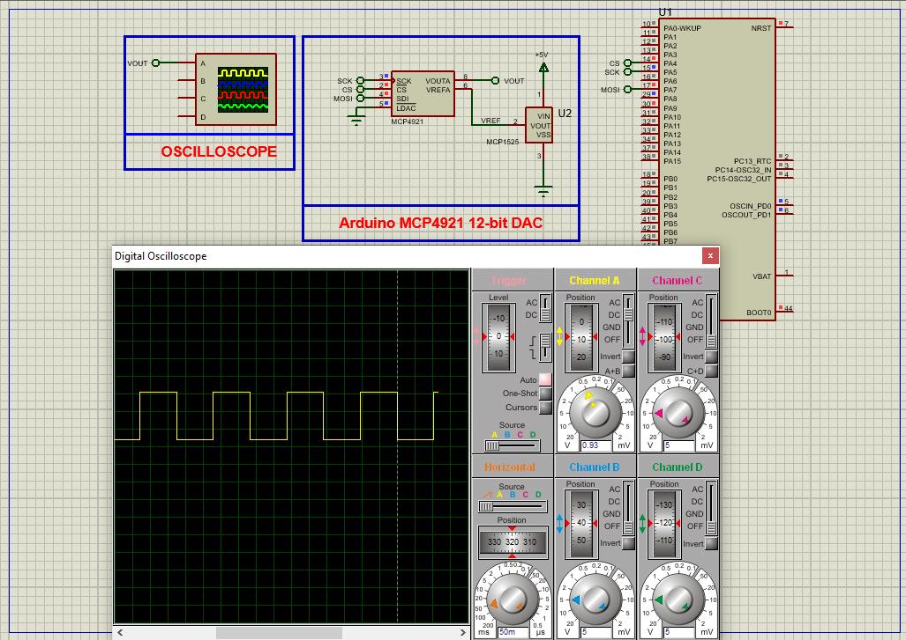

# STM32 12-bit DAC MCP4921: Analog Signal Generation  

This project demonstrates **high-precision analog signal generation** using the MCP4921 12-bit DAC with an STM32 microcontroller via SPI communication, suitable for waveform generation and control systems.  

---

## Hardware Requirements  
  
- **STM32F103C6 Microcontroller**  
- **MCP4921 12-bit DAC**  
- **MCP1525 Voltage Reference** (2.5V)  
- **3.3V/5V Power Supply**  
- **Oscilloscope** (for signal monitoring)  
- **Proteus 8.15+** (for simulation)  

---

## Circuit Overview  
### SPI Connections:  
- **SCK** → PA5 (SPI1 Clock)  
- **MOSI** → PA7 (SPI1 Data Out)  
- **CS** → PA4 (Chip Select)  
- **LDAC** → PA8 (Latch Control, optional)  
### Power:  
- **VDD** → 3.3V/5V  
- **VREF** → 2.5V (MCP1525)  

---

## Software Requirements  
- **STM32CubeMX** (for SPI/GPIO configuration)  
- **STM32CubeIDE** (for firmware development)  
- **Proteus 8.15+** (simulation)  

---

## Configuration Steps  

### STM32CubeMX Setup  
1. **MCU Selection**: STM32F103C6 (8MHz clock)  
2. **SPI1 Configuration**:  
   - Mode: Transmit Only Master  
   - Prescaler: 4 (4.0 Mbps)  
   - CPOL: Low, CPHA: 1 Edge  
3. **GPIO Configuration**:  
   - PA4 → Output (Chip Select)  
   - PA8 → Output (LDAC, optional)  
4. **Generate Code** in CubeIDE  

---

### STM32CubeIDE Implementation  
#### Key Functions:  
1. **DAC Initialization**:  
    - void DAC_Init(void)
2. **Channel Reading**:
    - void DAC_Write(uint16_t value) 
3. **Main Loop (Square Wave Example)**:
    - DAC_Write(0);
    - DAC_Write(4095);   

### Proteus Simulation  
1. **Components**:  
    - STM32F103C6, MCP4921, MCP1525, Oscilloscope
2. **Connections**:  
    - Match SPI pins (PA4-PA7)
    - Connect VREF to MCP1525
3. **Simulation**:  
   - Load `.hex` file  
   - Observe 0V→2.5V square wave on oscilloscope

## Troubleshooting  
- **No Output Signal**: Verify SPI clock with logic analyzer , Check VREF connection (2.5V)
- **Signal Noise**: Add 100nF capacitor between VDD/GND , Use shielded cables for analog outputs

## License  
**MIT License** — Free to use with attribution  