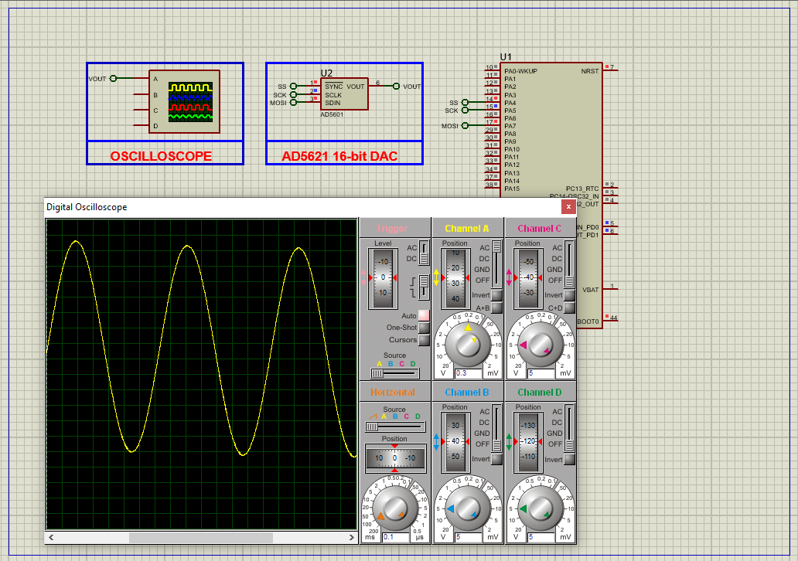

# STM32 AD5621 DAC Sinus Wave Generation  

This project demonstrates **high-resolution sine wave generation** using the AD5621 12-bit DAC with an STM32 microcontroller via SPI, ideal for audio and signal processing applications.  

---

## Hardware Requirements  
  
- **STM32F103C6 Microcontroller**  
- **AD5621 12-bit DAC**  
- **2.5V Voltage Reference**  
- **3.3V Power Supply**  
- **Oscilloscope** (for waveform analysis)  
- **Proteus 8.15+** (for simulation)  

---

## Circuit Overview  
### SPI Connections:  
- **SCK** → PA5 (SPI1 Clock)  
- **MOSI** → PA7 (SPI1 Data Out)  
- **SYNC** → PA4 (Chip Select)  
- **LDAC** → PA6 (Latch Control)  
### Power:  
- **VDD** → 3.3V  
- **VREF** → 2.5V  

---

## Software Requirements  
- **STM32CubeMX** (for SPI/GPIO configuration)  
- **STM32CubeIDE** (for firmware development)  
- **Proteus 8.15+** (simulation)  

---

## Configuration Steps  

### STM32CubeMX Setup  
1. **MCU Selection**: STM32F103C6 (72MHz clock)  
2. **SPI1 Configuration**:  
   - Mode: Full-Duplex Master  
   - Prescaler: 8 (9MHz SPI clock)  
   - CPOL: Low, CPHA: 1 Edge  
3. **GPIO Configuration**:  
   - PA4, PA6 → Outputs (SYNC and LDAC control)  
4. **Generate Code** in CubeIDE  

---

### STM32CubeIDE Implementation  
#### Key Functions:  
1. **DAC Initialization**:  
    - void DAC_Init(void)
2. **Sine Wave Table**:
    - const uint16_t sine_table[64] = {2048, 2248, 2447, 2642, 2831, 3013, 3185, 3346,...};
3. **Main Loop**:
    - void Generate_Sine_Wave(void)  
### Proteus Simulation  
1. **Components**:  
    - STM32F103C6, AD5621, Oscilloscope
2. **Connections**:  
    - Match SPI pins (PA4-PA7)
    - Connect VREF to 2.5V source
3. **Simulation**:  
   - Load `.hex` file  
   - Observe sine wave on oscilloscope (1Vpp @ 50Hz)

## Troubleshooting  
- **Distorted Waveform**:Verify SPI clock polarity/phase , Check VREF stability with multimeter
- **No Output**: Confirm SYNC/LDAC pin toggling , Measure SPI signals with logic analyzer

## License  
**MIT License** — Free to use with attribution  