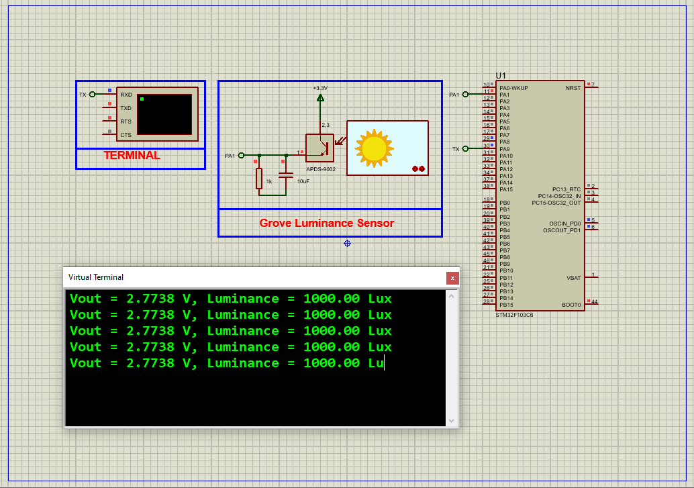

# STM32 APDS-9005 Luminance Sensor Interface  

This project demonstrates **ambient light sensing** using the APDS-9005 luminance sensor with an STM32 microcontroller, featuring ADC conversion and UART-based Lux value reporting.  

---

## Hardware Requirements  
  
- **STM32F103C6 Microcontroller**  
- **APDS-9005 Ambient Light Sensor**  
- **10kΩ Resistor** (for voltage divider if needed)  
- **3.3V Power Supply**  
- **USB-UART Converter** (for serial monitoring)  
- **Proteus 8.15+** (for simulation)  

---

## Circuit Overview  
### Sensor Connections:  
- **VOUT** → PA0 (ADC1_IN0)  
- **VDD** → 3.3V  
- **GND** → Common Ground  
### UART Debug:  
- **PA9 (TX)** → USB-UART RX (115200 baud)  

---

## Software Requirements  
- **STM32CubeMX** (for ADC/UART configuration)  
- **STM32CubeIDE** (for firmware development)  
- **Proteus 8.15+** (simulation)  

---

## Configuration Steps  

### STM32CubeMX Setup  
1. **MCU Selection**: STM32F103C6 (8MHz clock)  
2. **ADC1 Configuration**:  
   - Channel: IN0 (PA0)  
   - Resolution: 12-bit  
   - Continuous Conversion Mode: Enabled  
3. **UART1 Configuration**:  
   - Baud Rate: 115200  
   - Word Length: 8 bits  
4. **Generate Code** in CubeIDE  

---

### STM32CubeIDE Implementation  
#### Key Functions:  
1. **Lux Calculation**:  
    - float ConvertToLux(uint16_t adc_value) 
2. **Sensor Reading & UART Output**:
    - raw_value = HAL_ADC_GetValue(&hadc1)
    - lux = ConvertToLux(raw_value)
    - sprintf(msg, "Luminance: %.2f Lux\r\n", lux);
3. **Main Loop**:
    -  ReadAndPrintLuminance();

### Proteus Simulation  
1. **Components**:  
    - STM32F103C6, APDS-9005 (simulated with potentiometer), Virtual Terminal
2. **Connections**:  
    - PA0 → Sensor VOUT
    - PA9 → Terminal RX
3. **Simulation**:  
   - Load `.hex` file  
   - Adjust potentiometer to simulate light changes
   - Monitor Lux values in terminal

## Troubleshooting  
- **Dark Calibration**:Cover sensor and record ADC value → 0 Lux
- **Bright Light Calibration**: Expose to known light source (e.g., 500 Lux) and adjust LUX_PER_VOLT

## License  
**MIT License** — Free to use with attribution  
