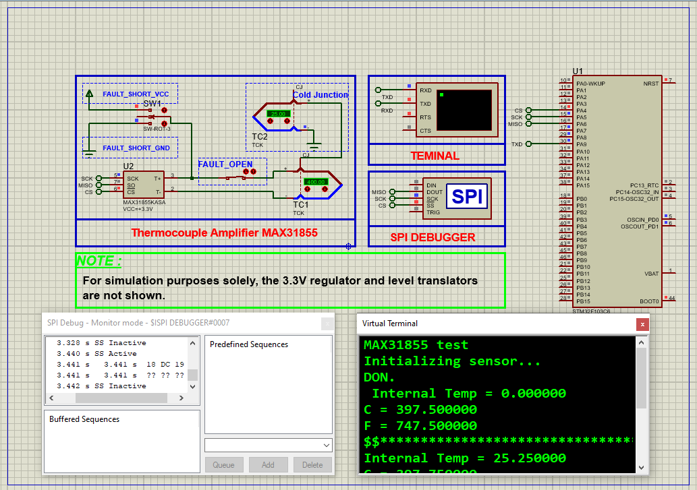

# STM32 MAX31855 Thermocouple Interface: A Comprehensive Guide  

This project demonstrates **high-precision temperature measurement** using a K-type thermocouple with the MAX31855 SPI interface and STM32 microcontroller, featuring cold-junction compensation and fault detection.  

---

## Hardware Requirements  
  
- **STM32F103C6 Microcontroller**  
- **MAX31855 Thermocouple-to-Digital Converter**  
- **K-Type Thermocouple**  
- **3.3V Power Supply**  
- **0.1µF Decoupling Capacitor**  
- **Proteus 8.15+** (for simulation)  

---

## Circuit Overview  
### SPI Connections:  
- **SCK** → PA5 (SPI1_CLK)  
- **MISO** → PA6 (SPI1_MISO)  
- **MOSI** → PA7 (SPI1_MOSI)  
- **CS** → PA4 (Chip Select)  
### Power:  
- **VCC** → 3.3V  
- **GND** → Common Ground  

---

## Software Requirements  
- **STM32CubeMX** (for SPI/GPIO configuration)  
- **STM32CubeIDE** (for firmware development)  
- **Proteus 8.15+** (simulation)  

---

## Configuration Steps  

### STM32CubeMX Setup  
1. **MCU Selection**: STM32F103C6 (8MHz clock)  
2. **SPI1 Configuration**:  
   - Mode: Full-Duplex Master  
   - Prescaler: 32 (250kHz clock)  
   - CPOL: Low, CPHA: 1 Edge  
3. **GPIO Configuration**:  
   - PA4 → Output (Chip Select)  
4. **UART1 Configuration**:  
   - Baud Rate: 9600  
   - Word Length: 8 bits  
5. **Generate Code** in CubeIDE  

---

### STM32CubeIDE Implementation  
#### Key Functions:  
1. **Temperature Reading**:  
    - float Read_MAX31855_Temperature(void) 
2. **Fault Detection Handling**
    - void Check_Faults(uint32_t raw_data)
3. **Main Loop**:
    - temp = Read_MAX31855_Temperature()
    - printf("Temperature: %.2f°C\r\n", temp);

### Proteus Simulation  
1. **Components**:  
    - STM32F103C6, MAX31855, K-TYPE-THERMOCOUPLE, Virtual Terminal 
2. **Connections**:  
    - Match SPI pins (PA4-PA7)
    - Connect thermocouple to MAX31855
3. **Simulation**:  
   - Load `.hex` file  
   - Set thermocouple temperature in component properties
   - Monitor output via terminal

## Troubleshooting  
- **SPI Communication Failures**:Verify logic levels with oscilloscope , Ensure CS toggles between transfers
- **Incorrect readings**: Check thermocouple polarity (red = negative) , Confirm 3.3V power stability

## License  
**MIT License** — Free to use with attribution  