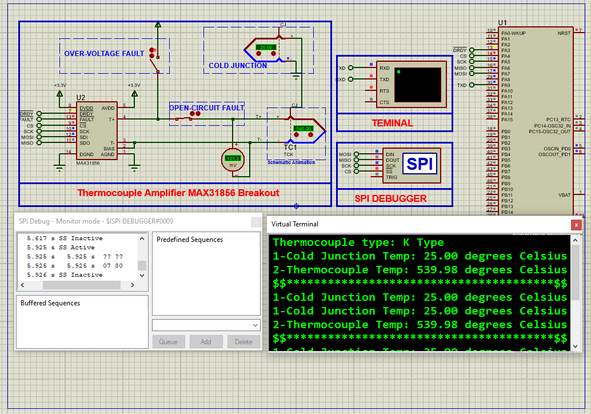

# STM32 with MAX31856 Thermocouple Amplifier  

This project demonstrates **high-resolution temperature measurement** using the MAX31856 thermocouple amplifier with an STM32 microcontroller, featuring **19-bit ADC precision**, **multi-thermocouple support**, and **advanced fault detection**.

---

## Hardware Requirements  
  
- **STM32F103C6 Microcontroller**  
- **MAX31856 Thermocouple-to-Digital Converter**  
- **K/J/T/N/S/R/E/B-Type Thermocouple**  
- **3.3V Power Supply**  
- **0.1µF Decoupling Capacitor**  
- **Proteus 8.15+** (for simulation)  

---

## Circuit Overview  
### SPI Connections:  
- **SCK** → PA5 (SPI1_CLK)  
- **MISO** → PA6 (SPI1_MISO)  
- **MOSI** → PA7 (SPI1_MOSI)  
- **CS** → PA4 (Chip Select)  
- **DRDY** → PA3 (Data Ready Interrupt)  
### Power:  
- **VDD** → 3.3V  
- **GND** → Common Ground  

---

## Software Requirements  
- **STM32CubeMX** (for SPI/GPIO configuration)  
- **STM32CubeIDE** (for firmware development)  
- **Proteus 8.15+** (simulation)  

---

## Configuration Steps  

### STM32CubeMX Setup  
1. **MCU Selection**: STM32F103C6 (8MHz clock)  
2. **SPI1 Configuration**:  
   - Mode: Full-Duplex Master  
   - Prescaler: 32 (250kHz clock)  
   - CPOL: Low, CPHA: 1 Edge  
3. **GPIO Configuration**:  
   - PA4 → Output (Chip Select)  
   - PA3 → Input (DRDY Interrupt)  
4. **UART1 Configuration**:  
   - Baud Rate: 9600  
   - Word Length: 8 bits  
5. **Generate Code** in CubeIDE  

---

### STM32CubeIDE Implementation  
#### Key Functions:  
1. **MAX31856 Initialization**:  
    - void MAX31856_Init(void) 
2. **Multi-Thermocouple Support**:
    - void Set_Thermocouple_Type(uint8_t type)
3. **Temperature Reading with Fault Check:**:
    - float Read_MAX31856_Temperature(void)
4. **Main Loop**:
    - float temp = Read_MAX31856_Temperature()
    - printf("Temperature: %.2f°C\r\n", temp)

### Proteus Simulation  
1. **Components**:  
    - STM32F103C6, MAX31856, K-TYPE-THERMOCOUPLE, Virtual Terminal
2. **Connections**:  
    - Match SPI pins (PA3-PA7)
    - Set thermocouple type in MAX31856 properties
3. **Simulation**:  
   - Load `.hex` file  
   - Adjust thermocouple temperature
   - Monitor output via terminal

## Troubleshooting  
- **SPI Timeouts**:Verify clock polarity/phase matches MAX31856 , Check CS signal with logic analyzer
- **Incorrect readings**: Confirm thermocouple type in CR0 register , Ensure cold-junction sensor is unobstructed

## License  
**MIT License** — Free to use with attribution  
