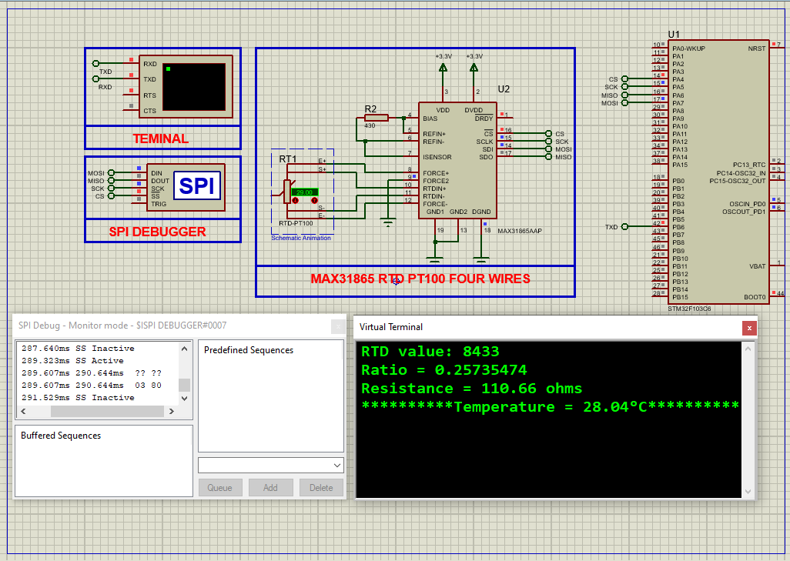

# STM32 MAX31865 Temperature Sensing  

This project demonstrates **high-precision RTD temperature measurement** using the MAX31865 platinum resistance thermometer (PT100/PT1000) interface with an STM32 microcontroller, featuring **3-wire/4-wire compensation** and **16-bit ADC resolution**.

---

## Hardware Requirements  
  
- **STM32F103C6 Microcontroller**  
- **MAX31865 RTD-to-Digital Converter**  
- **PT100 or PT1000 RTD Sensor**  
- **3.3V Power Supply**  
- **0.1µF Decoupling Capacitor**  
- **Proteus 8.15+** (for simulation)  

---

## Circuit Overview  
### SPI Connections:  
- **SCK** → PA5 (SPI1_CLK)  
- **MISO** → PA6 (SPI1_MISO)  
- **MOSI** → PA7 (SPI1_MOSI)  
- **CS** → PA4 (Chip Select)  
### RTD Wiring:  
- **2/3/4-wire** configuration (jumper selectable)  
- **REF** resistor (400Ω for PT100, 4kΩ for PT1000)  

---

## Software Requirements  
- **STM32CubeMX** (for SPI/GPIO configuration)  
- **STM32CubeIDE** (for firmware development)  
- **Proteus 8.15+** (simulation)  

---

## Configuration Steps  

### STM32CubeMX Setup  
1. **MCU Selection**: STM32F103C6 (8MHz clock)  
2. **SPI1 Configuration**:  
   - Mode: Full-Duplex Master  
   - Prescaler: 32 (250kHz clock)  
   - CPOL: Low, CPHA: 1 Edge  
3. **GPIO Configuration**:  
   - PA4 → Output (Chip Select)  
4. **UART1 Configuration**:  
   - Baud Rate: 9600  
   - Word Length: 8 bits  
5. **Generate Code** in CubeIDE  

---

### STM32CubeIDE Implementation  
#### Key Functions:  

1. **MAX31865 Initialization**  
   - `begin()`: Configures SPI interface and initializes MAX31865 with specified wiring mode  
   - `setWires()`: Sets 2/3/4-wire RTD configuration  
   - `enableBias()`: Controls bias voltage for measurements  

2. **Measurement Functions**  
   - `readRTD()`: Performs single-shot RTD measurement and returns raw value  
   - `temperature()`: Converts raw RTD value to temperature in °C  
   - `calculateTemperature()`: Implements Callendar-Van Dusen equation for precise conversion  

3. **Fault Handling**  
   - `readFault()`: Reads fault status register with configurable detection cycle  
   - `clearFault()`: Resets fault status register  
   - Fault detection types:  
     - `MAX31865_FAULT_AUTO`: Automatic periodic detection  
     - `MAX31865_FAULT_MANUAL_RUN`: Manual detection start  
     - `MAX31865_FAULT_MANUAL_FINISH`: Manual detection completion  

4. **Configuration Functions**  
   - `autoConvert()`: Enables/disables continuous conversion mode  
   - `enable50HzFilter()`: Toggles 50Hz noise rejection filter  
   - `setThresholds()`: Configures high/low fault detection limits  

5. **SPI Communication**  
   - `writeRegister8()`: Writes 8-bit value to specified register  
   - `readRegister8()`/`readRegister16()`/`readRegister24()`: Reads registers with different widths  
   - `readRegisterN()`: Generic multi-byte register read  

6. **Main Application Flow**  
   - Initializes MAX31865 in 4-wire mode  
   - Periodically reads RTD value and calculates temperature  
   - Monitors fault status and reports via UART  
   - Implements proper measurement sequencing:  
     1. Enable bias voltage  
     2. Trigger conversion  
     3. Read result  
     4. Disable bias to reduce self-heating  

## Troubleshooting  

### Hardware Issues  
- **No Temperature Readings**:  
  - Verify 3.3V power to MAX31865 (pin 8)  
  - Check SPI connections (SCK=PA5, MISO=PA6, CS=PA4)  
  - Confirm RTD wiring matches configuration (2/3/4-wire)  

### Configuration Problems  
- **Incorrect Temperatures**:  
  - Validate reference resistor value (`#define PREF`)  
  - Check `RNOMINAL` matches RTD type (100.0 for PT100)  
  - Ensure correct wiring mode in `begin(MAX31865_xWIRE)`  

### Communication Errors  
- **SPI Failures**:  
  - Confirm CPOL=0, CPHA=1 in SPI settings  
  - Check CS signal toggles during transactions  
  - Verify SCK frequency ≤5MHz (use prescaler 4+ for 8MHz clock)  

### Fault Conditions  
- **Fault LED/Message**:  
  - `0x01`: RTD short to VCC - check sensor wiring  
  - `0x02`: RTD short to GND - inspect for pinched cables  
  - `0x20`: Power fault - measure 3.3V supply stability  

### Simulation Issues  
- **Proteus Errors**:  
  - Set RTD type in component properties  
  - Add 100nF decoupling capacitor in schematic  
  - Verify virtual terminal baud rate matches code (9600/115200)  

### Performance Optimization  
- **Noisy Readings**:  
  - Enable 50Hz filter in noisy environments  
  - Implement moving average filter in software  
  - Use shielded cables for RTD connections  

## License  
**MIT License** — Free to use with attribution  

